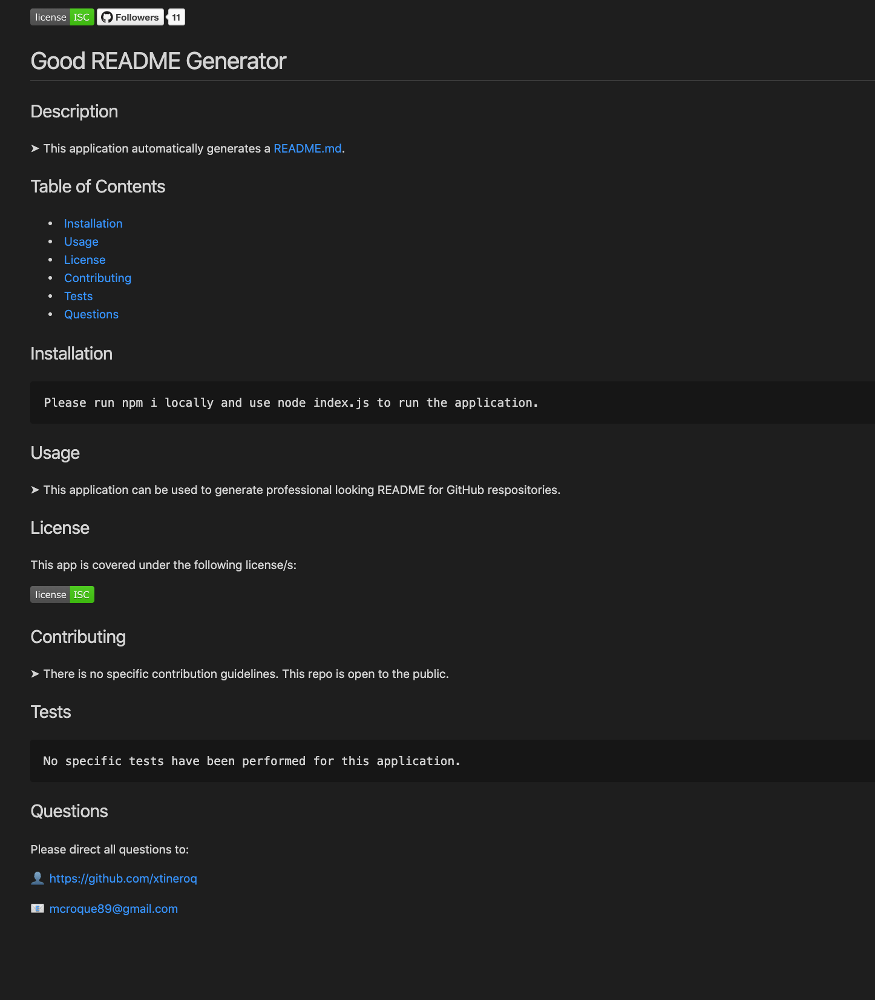

[](https://github.com/xtineroq?tab=followers)

# Good README Generator

## Description
This application automatically generates a README.md for your GitHub repository.

## Table of Contents
* [Acceptance Criteria](#acceptance-criteria)
* [Installation](#installation)
* [Usage](#usage)
* [License](#license)
* [Contributing](#contributing)
* [Tests](#tests)
* [Questions](#questions)
* [Video Link](#video-link)
* [Sample README](#sample-readme)
* [Screenshot](#screenshot)

## Acceptance Criteria
```
GIVEN a command-line application that accepts user input
WHEN the user is prompted for information about their application repository
THEN a quality, professional README.md is generated with the title of the project and sections entitled Description, Table of Contents, Installation, Usage, License, Contributing, Tests, and Questions
WHEN the user enters their project title
THEN this is displayed as the title of the README
WHEN the user enters a description, installation instructions, usage information, contribution guidelines, and test instructions
THEN this information is added to the sections of the README entitled Description, Installation, Usage, Contributing, and Tests
WHEN the user chooses a license for their application from a list of options
THEN a badge for that license is added to the top of the README and a notice is added to the section of the README entitled License that explains which license the application is covered under
WHEN the user enters their GitHub username
THEN this is added to the section of the README entitled Questions, with a link to their GitHub profile
WHEN the user enters their email address
THEN this is added to the section of the README entitled Questions, with instructions on how to reach them with additional questions
WHEN the user clicks on the links in the Table of Contents
THEN the user is taken to the corresponding section of the README
```

## Installation
```
Please run npm i locally and user node index.js to run the application.
```

## Usage
➤ This application makes it easy for developers to generate a professional README for the GitHub repository.

## License
This app is covered under the following license/s:


## Contributing
➤ This repository is open to the public. Please take the time to notify the repository owner prior to making any contributions.

## Tests
```
No specific tests have been performed for this application.
```

## Questions
Please direct all questions to:
*  👤 https://github.com/xtineroq

## Video Link
[Walkthrough Video](https://www.loom.com/share/c6177bdce1b84fcb9bf302f808ce0d7a)

## Sample README
[VIEW](./NewREADME/README.md) a sample README.md file generated using this application.

## Screenshot

